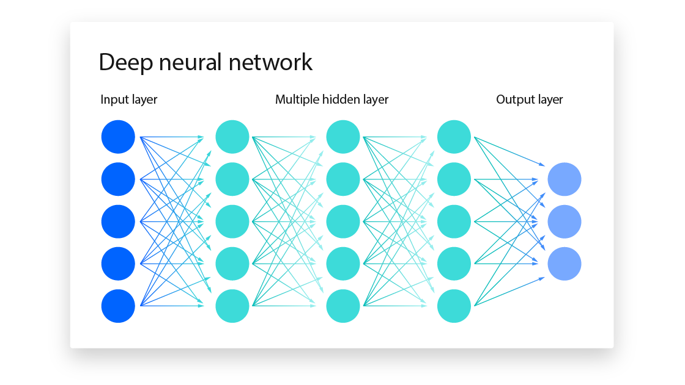

# Класифікація сортів родзинок за допомогою Глибокого Навчання (PyTorch)

Цей проєкт є практичною реалізацією Лабораторної роботи №4 з дисципліни «Теорія і методи обчислювального інтелекту». Його головна мета — розробка, тренування та налаштування глибокої нейронної мережі (багатошарового перцептрона) для розв'язання задачі бінарної класифікації з використанням фреймворку **PyTorch**.

## Про датасет
Система працює з набором даних `variant2-raisin.csv`. Модель аналізує числові (геометричні) ознаки родзинок та класифікує їх на два сорти:
* `Kecimen` (Клас 0)
* `Besni` (Клас 1)

## Головні особливості (Features)
Проєкт реалізує повний цикл машинного навчання:
* **Кастомний Dataset та DataLoader:** Подача даних батчами для ефективного навчання.
* **Глибока архітектура (MLP):** 4 приховані шари з поступовим зменшенням розмірності.
* **Стабілізація:** Використання шарів `BatchNorm1d` та `Dropout` для запобігання перенавчанню (overfitting).
* **Порівняння оптимізаторів:** Одночасне тренування та порівняння 5 конфігурацій (Adam, SGD + Momentum, RMSprop, L1 та L2 регуляризації).
* **Розумне навчання:** Реалізовано динамічну зміну кроку навчання (`ReduceLROnPlateau`) та ранню зупинку (`Early Stopping`).
* **Оцінка (Metrics):** Автоматичний вибір найкращої моделі, обчислення Accuracy, Precision, Recall, F1-score та побудова ROC-кривої (AUC).

<p style="color: #9b21a9; justify-self: center; font-weight: 700; font-size: 24px">Neural Network example</p>


## Стек технологій
* **Python 3.8+**
* **PyTorch** (Побудова та навчання нейромережі)
* **Pandas / NumPy** (Обробка даних)
* **Scikit-learn** (Нормалізація, розбиття вибірок, обчислення метрик)
* **Matplotlib** (Візуалізація Loss-графіків та ROC-кривої)

---

## Як встановити та запустити

### 1. Клонування репозиторію
Завантажте проєкт на свій локальний комп'ютер:
```bash
git clone https://github.com/Yushchyk-Roman/CI.git
cd CI
```
### 2. Встановлення залежностей
Переконайтеся, що у вас встановлений Python. Рекомендується створити віртуальне середовище (virtualenv) та встановити необхідні бібліотеки:

```bash
pip install -r requirements.txt
```

### 3. Підготовка даних
Переконайтеся, що файл variant2-raisin.csv знаходиться в одній папці (кореневій директорії) з Jupyter Notebook.

### 4. Запуск проєкту
Відкрийте Jupyter Notebook:

```Bash
jupyter notebook
'Відкрийте файл з кодом neural-networks.ipynb.'
```
## Як користуватися (Покрокове виконання)
Проєкт розбитий на 5 логічних етапів (комірок). Запускайте їх послідовно (Shift + Enter):

- Етап 1: Завантажує дані, кодує класи, розбиває їх на Train/Val/Test та нормалізує за допомогою StandardScaler.
- Етап 2: Створює PyTorch тензори та обгортає їх у DataLoader для генерації міні-батчів.
- Етап 3: Ініціалізує архітектуру глибокого класифікатора (DeepClassifier).
- Етап 4: Завантажує алгоритм циклу навчання (train_model), який містить логіку зворотного поширення помилки, L1-штрафів та Early Stopping.
- Етап 5: Запускає порівняльний експеримент. Навчає 5 різних моделей, будує графіки функції втрат, автоматично вибирає найкращу конфігурацію і виводить фінальні метрики на тестових даних.

## Очікувані результати
Після виконання останньої комірки ви побачите:
- Сітку графіків Loss для кожного оптимізатора.
- Повідомлення про динамічно обрану модель (наприклад, Динамічно обрана найкраща модель: Adam + L2 (0.01)).
- Звіт з класифікації (Accuracy, Precision, Recall, F1-score).
- Графік ROC-кривої з високим значенням AUC (зазвичай > 0.94).