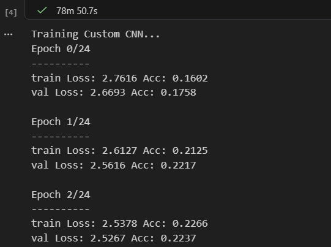
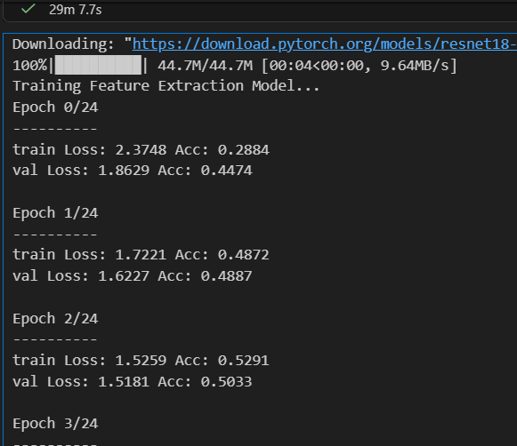

# Класифікація аніме за допомогою згорткових нейромереж (PyTorch)

Цей проєкт реалізує повний цикл підготовки даних, навчання та оцінки моделей комп'ютерного зору (Computer Vision) для класифікації зображень за 20 різними категоріями (стилями/франшизами аніме). 

Проєкт розроблено в рамках лабораторної роботи і містить порівняння трьох різних архітектурних підходів:
1. Власна згорткова нейромережа (Custom CNN), написана з нуля.
2. Transfer Learning: Feature Extraction (використання замороженої бази `ResNet18`).
3. Transfer Learning: Fine-Tuning (розморожування верхніх шарів `ResNet18` для тонкого налаштування).

---

## Технологічний стек

* **Мова програмування:** Python 3.8+
* **Фреймворк для Deep Learning:** PyTorch, Torchvision
* **Обробка та візуалізація даних:** NumPy, Matplotlib, Seaborn
* **Метрики:** Scikit-learn

---

## Встановлення та налаштування

**Крок 1. Клонування або завантаження репозиторію**
Збережіть усі файли проєкту (включно з папкою `images`) на свій комп'ютер.

**Крок 2. Створення віртуального середовища**
```bash
python -m venv venv
source venv/bin/activate  # Для Linux/Mac
venv\Scripts\activate     # Для Windows
```

**Крок 3. Встановлення залежностей**
Встановіть необхідні бібліотеки за допомогою `pip`:
```bash
pip install torch torchvision matplotlib seaborn scikit-learn numpy
```
*Примітка: Для максимальної швидкості навчання переконайтеся, що ви встановили версію PyTorch із підтримкою CUDA для вашої відеокарти NVIDIA (деталі на [pytorch.org](https://pytorch.org/get-started/locally/)).*

---

## Підготовка набору даних (Dataset)

Дані повинні бути організовані у стандартному форматі для `ImageFolder`. Створіть головну папку (наприклад, `variant4`), всередині якої будуть папки з назвами класів (аніме), а в них — відповідні зображення.

```text
dataset/
├── Naruto/
│   ├── img1.jpg
│   └── img2.jpg
├── One Piece/
│   ├── img1.jpg
│   └── img2.jpg
└── ... (інші 18 класів)
```

**Важливо:** Перед запуском коду обов'язково змініть шлях до вашого датасету у змінній `data_dir` на свій актуальний шлях:
```python
data_dir = 'Ваш_шлях_до_папки_з_датасетом'
```

---

## Використання (Запуск навчання)

Проєкт можна запускати як звичайний Python-скрипт або виконувати поблоково у Jupyter Notebook / Google Colab.

Програма автоматично виконає такі кроки:
1. Трансформацію та нормалізацію зображень до розміру `224x224`.
2. Навчання **Custom CNN** із механізмом Early Stopping.
3. Навчання моделі **Feature Extraction**.
4. Навчання моделі **Fine-Tuning**.
5. Побудову порівняльних графіків `Loss` та `Accuracy` для всіх трьох моделей.
6. Візуалізацію Матриці помилок (Confusion Matrix) для найкращої моделі.

---

## Архітектурні рішення

### Власна нейромережа (Custom CNN)
Наша базова мережа складається з трьох згорткових блоків (Conv2d -> BatchNorm2d -> ReLU -> MaxPool2d). Головною особливістю є використання `AdaptiveAvgPool2d` (Global Average Pooling) замість класичного шару Flatten. Це дозволило суттєво зменшити кількість вагових коефіцієнтів та уникнути перенавчання.



### Transfer Learning (Feature Extraction та Fine-Tuning)
Для вирішення складніших задач розпізнавання ми використали попередньо навчену на датасеті ImageNet модель **ResNet18**. 

* У підході **Feature Extraction** ми повністю заморозили згорткову базу і тренували лише новий фінальний класифікатор.
* У підході **Fine-Tuning** ми додатково розморозили останній блок (`layer4`) і використали мікро-крок навчання (`lr=0.0001`), щоб адаптувати складні візуальні фільтри під специфічну рисовку аніме.



---

## Аналіз результатів
Як показала візуалізація метрик, методи Transfer Learning (особливо Fine-Tuning) значно перевершують власну CNN за швидкістю збіжності та підсумковою точністю на валідаційній вибірці. Матриця помилок підтверджує, що модель успішно знаходить глибинні патерни, плутаючись лише у візуально схожих франшизах.